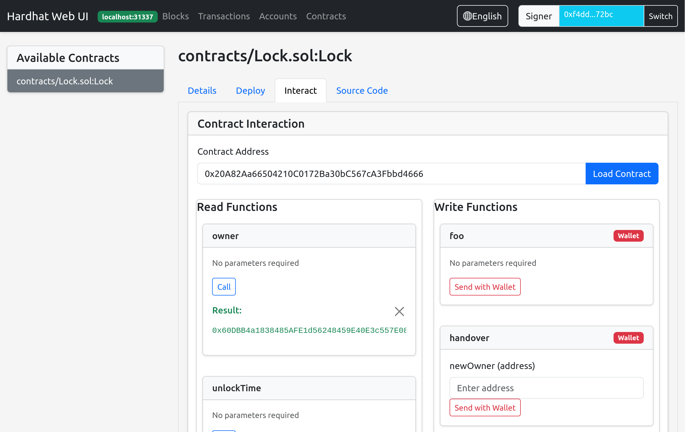
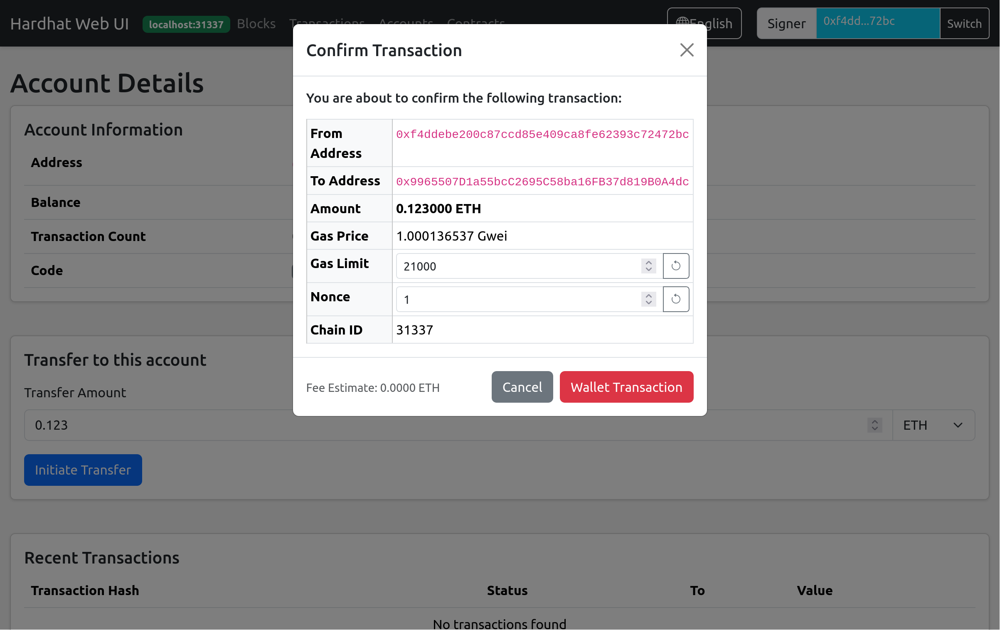

# Hardhat Web UI Plugin

- Provides a WEB UI to view network, block, account, contract and other information
- Provides contract interaction functionality (similar to REMIX)

## Features
- View blocks
- View accounts
- View transactions
- Browse all contracts in the project
- View contract ABI and bytecode
- Deploy contracts to the network
- Interact with deployed contracts (call read and write functions)





## Installation

```bash
npm install hardhat-web-ui --save-dev
```

## Usage

Import the plugin in your hardhat.config.js:

```javascript
require("hardhat-web-ui");
```

Start the Web UI:

```bash
npx hardhat web-ui --network <network-name>
# e.g.
npx hardhat web-ui --network localhost
```

Then access http://localhost:3337 in your browser

## Configuration

The plugin can be configured in hardhat.config.js:

```javascript
module.exports = {
  webUI: {
    enabled: true,
    localChainIds: [31337, ...],
    port: 3337,
  }
};
```
